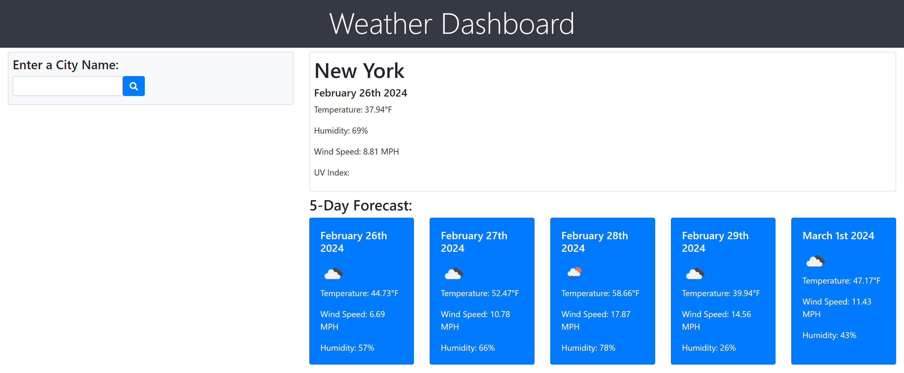

# Jaysons-Weather-Dashboard-1
# Description
With a user friendly interace users will be able to search for any city and be presented with the current and future weather conditions for that city.Users will also be able to see an icon representing the weather condtion in a 5 day forecast format.Using the Openweather api the current and future weather data will be fetch and returned back where the user will see the data dynamically on the page. 
 
# Links
Repo:https://github.com/JaysonNunez1/Jaysons-Weather-Dashboard-1 
 
 
Deployed site:https://jaysonnunez1.github.io/Jaysons-Weather-Dashboard-1/
 
# Screenshot

# Credits
Openweather Api
 
 
Bootstrap
 
 
jquery
 
 
moment.js 

